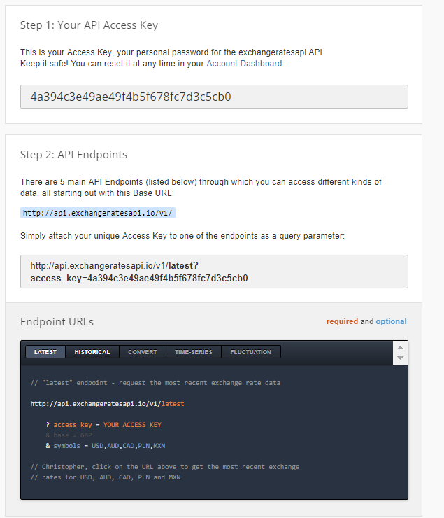

# CBO Coding Challenge Question 24 - 1 point

Write a program that converts currencies (e.g. $1 CAD -> $1.2 USD).

For this problem, you will be using real-time data provided by [exchangeratesapi's](https://exchangeratesapi.io/) application programming interface (API). This allows us to provide accurate information without having to manually input everything in ourselves!

You may see the following image for reference.

The access key is: 4a394c3e49ae49f4b5f678fc7d3c5cb0

